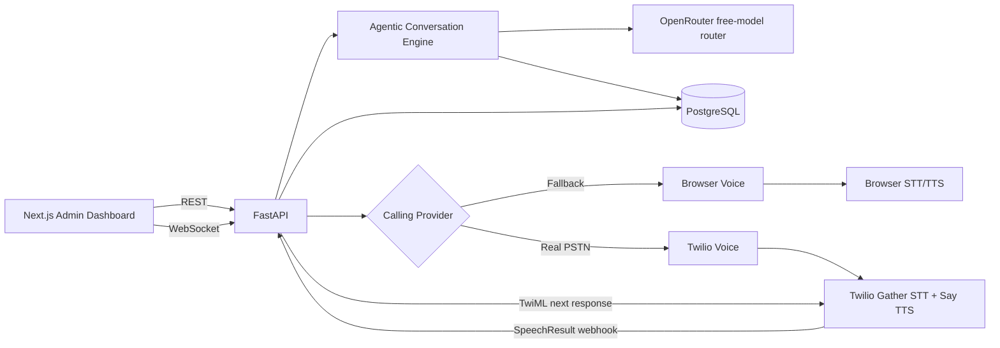
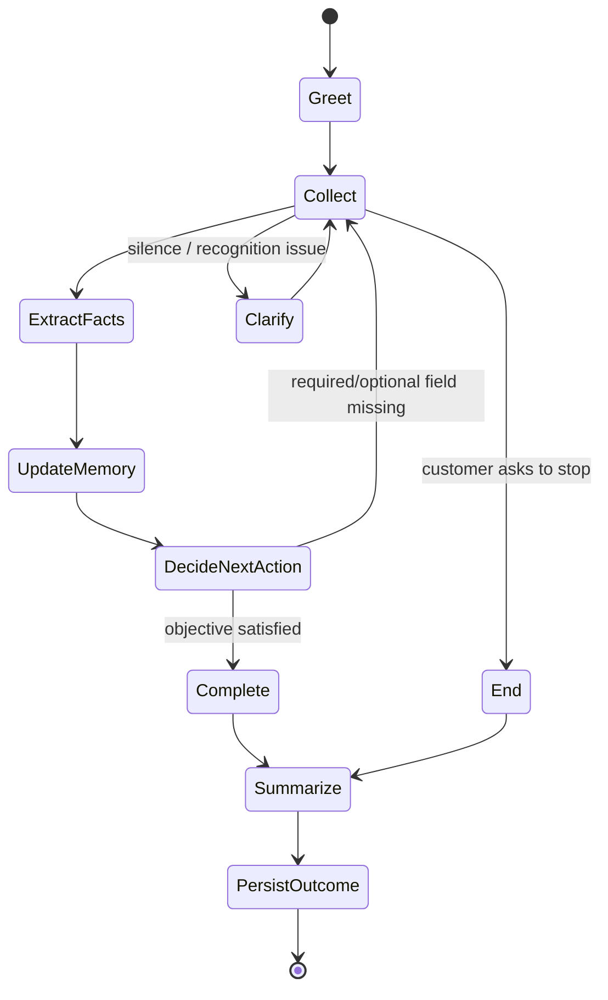
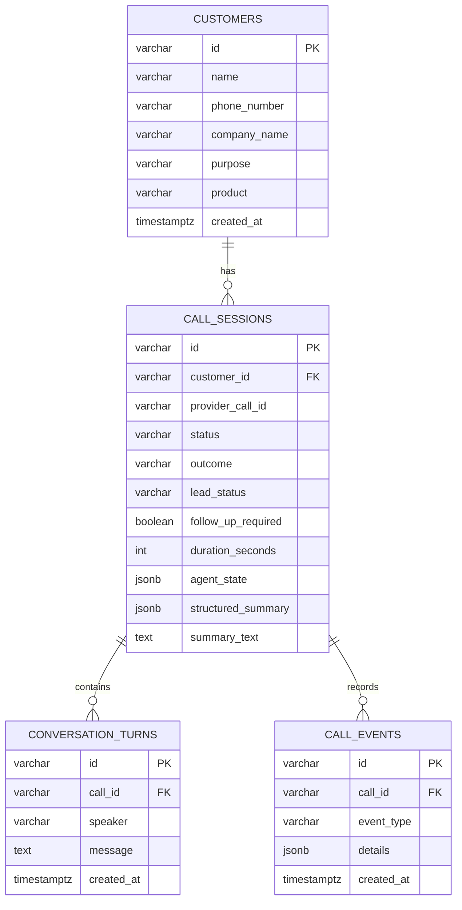

# AI-Powered Two-Way Calling Agent

Take-home assignment implementation for the Python Developer technical evaluation. The system can create a customer/campaign, initiate an autonomous AI call, conduct a two-way voice conversation, maintain qualification context, store every turn in PostgreSQL, generate a structured AI call summary, and expose results in a Next.js admin dashboard.

## What is implemented

- **FastAPI backend** with REST endpoints, WebSocket real-time call channel and OpenAPI docs.
- **Agentic AI state machine** that tracks collected/missing fields and chooses the next objective instead of blindly forwarding every sentence to an LLM.
- **GenAI integration** using OpenRouter through a small REST adapter. The default `openrouter/free` router selects from currently available zero-cost models. If the provider/key is temporarily unavailable, deterministic extraction/policy fallback keeps the demo working instead of crashing.
- **Real outbound PSTN mode** through Twilio Voice. The default path uses Twilio speech `<Gather>` + `<Say>` so the destination phone actually rings, the receiver speech reaches FastAPI as `SpeechResult`, and the AI response is spoken back into the same phone call. An optional ConversationRelay mode is retained for enabled/upgraded accounts.
- **Interruption handling:** nested speech `<Gather>` can accept caller speech while prompts play; optional ConversationRelay mode additionally records explicit `interrupt` events for enabled accounts.
- **Clearly separate browser voice fallback** using browser speech recognition (STT) + Web Speech speech synthesis (TTS), with typed-response fallback. It is labelled as a browser demo and is never presented as a real phone call.
- **PostgreSQL persistence** for customers, call sessions, conversation turns, agent state, call events, structured summary, outcome and follow-up state.
- **Next.js admin dashboard** with customer management, call initiation, statistics, call history, filtering, transcript, summary and live agent-memory view.
- **Error/event handling** for provider start failures, no answer, speech-recognition events, silence, disconnects, AI/API fallback and customer interruption.

## Architecture



### Agent workflow



The state tracks:

`customer_name`, `company_name`, `requirement`, `application`, `ro_capacity`, `location`, `budget`, `timeline`, `additional_requirements`, asked fields, completed fields, current objective, silence count and call status.

The policy checks completed fields first and only asks for the next missing objective. The LLM is used for structured extraction, natural acknowledgement and final summarization; conversation control remains explicit and testable.

## Technology choices

| Requirement | Implementation |
|---|---|
| Backend | Python + FastAPI |
| GenAI | OpenRouter API (`openrouter/free`, configurable) |
| Agentic AI | Stateful slot-memory + policy/action engine + LLM extraction |
| STT | Twilio speech `<Gather>` on default real PSTN calls; optional ConversationRelay; Browser SpeechRecognition in fallback demo |
| TTS | Twilio `<Say>` on default real PSTN calls; optional ConversationRelay; browser `speechSynthesis` in fallback demo |
| Frontend | Next.js 16.3.6 + React 19.2 |
| Database | PostgreSQL + SQLAlchemy |
| Real-time | WebSocket (`/ws/calls/{call_id}`) |
| Calling | Explicit real Twilio PSTN button + separately labelled browser fallback |

## Project structure

```text
/backend
  /app
    /agent          # state, policy, extraction, OpenRouter adapter
    /api            # REST, WebSocket and Twilio webhook routes
    /core           # configuration
    /services       # call lifecycle, summaries, telephony adapters
    main.py
    db.py
    models.py
    schemas.py
  /tests
/frontend
  /app
    /call/[id]      # live two-way browser voice call
    /calls/[id]     # transcript + summary details
    page.tsx        # dashboard/customer management/history
  /lib
/database
  schema.sql
README.md
.env.example
docker-compose.yml
```

# Local setup

## Prerequisites

- Python 3.12+ recommended
- Node.js 22+
- PostgreSQL 16/17, or Docker Desktop
- Chrome or Edge for browser speech recognition
- OpenRouter API key (free-model router is used by default)
- Twilio credentials + public HTTPS tunnel for real PSTN testing (browser fallback needs neither)

## 1. Clone / unzip

```bash
git clone <your-repository-url>
cd ai-calling-agent
```

## 2. Start PostgreSQL

Fastest option:

```bash
docker compose up -d postgres
```

Without Docker, create a database named `ai_calling_agent` and run `database/schema.sql` in pgAdmin/psql.

## 3. Backend environment

Windows PowerShell:

```powershell
cd backend
py -3.12 -m venv venv
venv\Scripts\Activate.ps1
pip install -r requirements.txt
Copy-Item ..\.env.example .env
```

macOS/Linux:

```bash
cd backend
python3 -m venv venv
source venv/bin/activate
pip install -r requirements.txt
cp ../.env.example .env
```

Edit `backend/.env` if your PostgreSQL username/password differs. Add `OPENROUTER_API_KEY` for full GenAI behavior. The default model is `openrouter/free`. **Use the key during the evaluator demo so the GenAI extraction/natural-response/summary path is visibly active; the deterministic fallback is for resilience, not a replacement for the assignment's GenAI requirement.**

Start FastAPI:

```bash
uvicorn app.main:app --reload --port 8000
```

API docs: `http://localhost:8000/docs`

## 4. Frontend environment

Open a second terminal:

```bash
cd frontend
npm install
```

Create `frontend/.env.local`:

```env
NEXT_PUBLIC_API_BASE=http://localhost:8000
```

Start Next.js:

```bash
npm run dev
```

Open `http://localhost:3000`.

# Demo A: real phone call (preferred interview demonstration)

Follow `REAL_CALL_SETUP.md`. Once `/api/telephony/config` reports `real_call_ready: true`:

1. Add a customer such as Rahul Kumar. The phone field accepts either `+919876543210` or a normal Indian 10-digit mobile number and normalizes it to E.164.
2. Click **Call customer's phone**.
3. The destination phone rings through Twilio; the dashboard opens a live monitor rather than asking for the laptop microphone.
4. Answer and speak on the destination phone. Twilio speech `<Gather>` sends `SpeechResult` to FastAPI; the agent chooses its next action and returns TwiML that speaks the AI answer back to the receiver.
5. Continue the conversation on the destination phone; the laptop microphone is never used in this mode.
6. The live transcript, agent state, status, summary and outcome are persisted to PostgreSQL.
7. If an enabled/upgraded Twilio account is available, `TWILIO_VOICE_MODE=relay` activates the lower-latency ConversationRelay WebSocket path with explicit interruption events.

# Demo B: browser two-way voice fallback

1. On the dashboard add a customer.
2. Click **Browser voice demo**.
4. On the live-call page click **Enable mic** and allow microphone access.
5. The AI speaks its opening line.
6. Answer naturally, e.g. `I need a 500 LPH system for drinking water in my hotel.`
7. The browser converts speech to text and sends it through the WebSocket to FastAPI.
8. The agent extracts facts, updates state and asks only the next missing question.
9. The AI response is read back via TTS.
10. Continue until capacity, location, budget, timeline and other useful context are collected.
11. When the objective completes, the call ends automatically, a structured summary is generated and the UI opens the call-details page.
12. Return to the dashboard to see updated statistics and filterable call history.

If browser STT is unavailable, use the typed reply field; all backend/agent/storage behavior stays identical.

## Example conversation

```text
AI: Hello Rahul. I am the AI calling assistant from AI Calling Agent about Commercial RO System.
    What RO capacity are you looking for, in litres per hour?
Customer: Around 500 LPH for my hotel.
AI: Got it. Which city will the system be installed in?
Customer: Bangalore.
AI: Got it. Do you have a target budget or budget range?
Customer: Around INR 1 lakh.
AI: Got it. When are you planning to purchase or install the system?
Customer: Within one month.
...
AI: Thank you. I have everything I need. I noted capacity 500 LPH, location Bangalore,
    budget INR 1 lakh, timeline within one month. Our team can follow up with you shortly.
```

# Real Twilio outbound call

The project includes a real Twilio adapter and deliberately refuses to present a simulated browser call as PSTN. The real-call button is disabled until Twilio credentials and a public callback URL are present. See `REAL_CALL_SETUP.md` for the exact configuration.

Set:

```env
TWILIO_ACCOUNT_SID=...
TWILIO_AUTH_TOKEN=...
TWILIO_FROM_NUMBER=...
TWILIO_VOICE_MODE=gather
TWILIO_RELAY_LANGUAGE=en-IN
TWILIO_VALIDATE_SIGNATURE=true
PUBLIC_BACKEND_URL=https://<your-public-https-tunnel-or-deployment>
```

`PUBLIC_BACKEND_URL` must be internet-accessible so Twilio can reach the HTTP callbacks. The default `gather` mode uses `<Gather input="speech">` for receiver STT and `<Say>` for TTS while FastAPI retains the agent policy, OpenRouter integration, transcript persistence and summary generation. Optional `TWILIO_VOICE_MODE=relay` uses ConversationRelay/WSS when that feature is enabled on the Twilio account.

## Free/trial limitations

- **OpenRouter free-model router:** `openrouter/free` routes requests to currently available free models; availability/rate limits can still apply. The application degrades to deterministic policy/extraction fallback if the AI API fails so the demo does not become unusable.
- **Browser STT/TTS:** no project-side paid subscription, but speech-recognition availability depends on browser/platform; Chrome/Edge are recommended.
- **Twilio trial:** trial Voice restricts recipients/geography and current Twilio documentation lists `<ConversationRelay>` as blocked during trial. `<Gather>`/`<Say>` are supported TwiML building blocks, so the project defaults to `gather`; however current trial outbound-API restrictions can still prevent a custom autonomous outbound flow on some accounts. Use the clearly labelled browser fallback if the trial blocks the live PSTN path.

Official references:
- OpenRouter free models: https://openrouter.ai/openrouter/free and https://openrouter.ai/collections/free-models
- Twilio trial Voice: https://www.twilio.com/docs/usage/trials/try-out-voice

# REST API

FastAPI also exposes interactive Swagger/OpenAPI documentation at `/docs`.

| Method | Endpoint | Purpose |
|---|---|---|
| GET | `/api/health` | Health check |
| POST | `/api/customers` | Add customer/contact |
| GET | `/api/customers` | List customers |
| POST | `/api/calls/start` | Initiate explicit `browser` or real `twilio` call mode |
| GET | `/api/telephony/config` | Check whether real PSTN calling is configured without exposing secrets |
| GET | `/api/calls` | List/filter calls |
| GET | `/api/calls/{id}` | Call detail, transcript, summary |
| POST | `/api/calls/{id}/end` | Finish call and generate summary |
| POST | `/api/calls/{id}/events` | Store client/provider error events |
| GET | `/api/dashboard` | Dashboard statistics |
| WS | `/ws/calls/{id}` | Real-time two-way browser call |
| POST | `/api/telephony/twilio/answer/{id}` | Twilio answer webhook; starts Gather loop by default or ConversationRelay if configured |
| WS | `/api/telephony/twilio/relay/{id}` | Real-time receiver prompts, AI text responses and interruption/error events |
| POST | `/api/telephony/twilio/relay-ended/{id}` | ConversationRelay completion callback |
| POST | `/api/telephony/twilio/status/{id}` | Ringing/answered/completed/no-answer/provider status callback |
| POST | `/api/telephony/twilio/respond/{id}` | Default real-call `<Gather>` speech-result/AI-response webhook |

### Search/filter parameters

`GET /api/calls` supports:

- `date=YYYY-MM-DD`
- `customer=<partial name>`
- `status=<status>`
- `lead_status=<status>`
- `follow_up_required=true|false`
- `outcome=<partial outcome>`

# Database design



`database/schema.sql` contains the complete DDL. SQLAlchemy creates missing tables automatically on local demo startup for convenience.

# Error handling covered

- Invalid phone number: Pydantic validation returns HTTP 422.
- Customer not found: HTTP 404.
- Provider start failure: call marked failed with error code/message and event.
- No answer/busy/provider failure: Twilio status callbacks update outcome/status.
- Speech recognition failure: frontend reports event and offers typed fallback.
- AI/OpenRouter failure or timeout: deterministic agent behavior continues and the failure is recorded as an event.
- Customer silence: reprompt once; second silence ends gracefully and records outcome path.
- Customer ends call: end-intent detection produces a polite close and summary.
- Customer interrupts AI: default real PSTN `<Gather>` mode can accept speech during a nested prompt; optional ConversationRelay mode records explicit `interrupt` events; browser fallback also supports **Interrupt & talk**.
- WebSocket disconnect: event is recorded.

# Security practices

- No secrets are committed; all credentials use environment variables.
- `.gitignore` excludes `.env`, local virtual environments, build output and `node_modules`.
- Pydantic validates phone input and request payloads.
- SQLAlchemy uses parameterized SQL rather than string-built queries.
- CORS is limited to the configured frontend origin.
- Provider/API failures return sanitized user-facing behavior while detailed state is stored server-side.
- For production: enable `TWILIO_VALIDATE_SIGNATURE=true`, add admin authentication/RBAC, rate limiting, encrypted PII, audit retention policy and HTTPS-only deployment.

# Tests

Backend agent tests do not require OpenRouter/Twilio credentials:

```bash
cd backend
pytest -q
```

The automated suite currently contains 15 tests covering slot collection/non-repetition, generic-purpose handling, customer-requested hangup, silence/no-response handling, not-interested disposition, LLM extraction/fallback behavior, structured summaries, boolean normalization, no-answer, disconnect and provider-failure outcomes.

A simulated end-to-end API/WebSocket audit was also run across customer creation, call start, live transcript persistence, qualification completion, not-interested handling, two-silence termination, event storage, all required call filters and dashboard statistics.

Frontend production check:

```bash
cd frontend
npm run build
```

# Future improvements

- Stream OpenRouter text tokens incrementally into optional ConversationRelay mode for even lower response latency.
- Add multilingual dynamic language switching and richer Voice Insights metrics.
- Admin login/RBAC and audit trail.
- Alembic migrations for production schema lifecycle.
- Redis-backed active call/session coordination for multi-instance deployment.
- Queue/retry worker for campaigns and provider callbacks.
- Multi-language voice selection and language detection.
- Consent/recording disclosure configuration and retention controls.
- CRM/webhook integrations and scheduled follow-up actions.
- Observability metrics for latency, STT confidence, LLM failures and funnel conversion.

# Submission demo checklist

- [ ] PostgreSQL running
- [ ] Backend `/api/health` returns `{ "status": "ok" }`
- [ ] Swagger opens at `/docs`
- [ ] Next.js dashboard opens
- [ ] Add a customer
- [ ] If Twilio is configured, place one **real** test call to a verified/consenting phone and show the receiver speaking on that phone
- [ ] Otherwise explicitly show **Browser voice demo** as the assignment-permitted fallback
- [ ] Demonstrate speech → agent → spoken AI response in the selected mode
- [ ] Show live agent-memory fields filling in
- [ ] Complete/hang up call
- [ ] Show full transcript in call details
- [ ] Show generated summary/outcome/follow-up
- [ ] Show dashboard statistics and filters
- [ ] Show source structure + `.env.example`
- [ ] Show Twilio adapter/config readiness and explain current trial restrictions without claiming the browser demo is PSTN


## Twilio account tier

For the full custom AI phone flow, use an **upgraded Twilio account** and set:

```env
TWILIO_ACCOUNT_TIER=upgraded
```

On a Twilio trial, the Create Call API only permits Twilio trial sample-call instruction URLs; the application therefore reports the real custom PSTN path as unavailable instead of pretending the trial call is using the agent. Use the Browser Voice Demo on trial, or switch this value to `upgraded` on your upgraded Twilio account.
